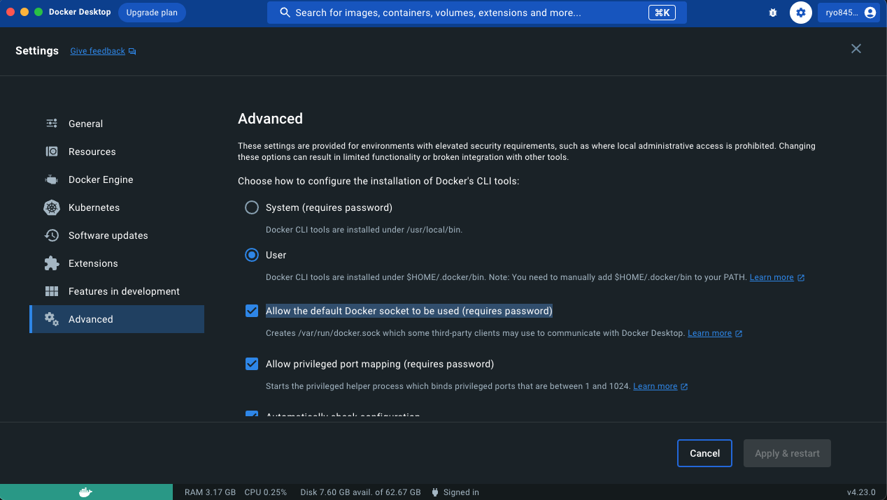

# Lambda(SAM)からAWS SQS(LocalStack) へメッセージ送信/受信を行うサンプル
LocalStack上で動くAWS SQSのキューに対してAWS SAM CLIで動くLambdaからメッセージ送受信を行う方法

## 事前準備
### AWS CLIのインストール
```bash
sudo apt  install awscli
```

### SAM CLIのインストール
https://docs.aws.amazon.com/ja_jp/serverless-application-model/latest/developerguide/install-sam-cli.html

### LocalStack用のプロファイルを作成
ローカルで使うだけなのでダミーの設定
```bash
aws configure --profile localstack
AWS Access Key ID [None]: dummy
AWS Secret Access Key [None]: dummy
Default region name [None]: ap-northeast-1
Default output format [None]: json
```

## LocalStackの設定
### githubからLocalStackをクローン

```bash
git clone https://github.com/localstack/localstack.git
cd localstack
```

### docker-compose.ymlを編集
networksを追加  
lambdaからlocalstackのコンテナにアクセスするために必要
```yml:docker-compose.yml
version: "3.8"

networks:
  container-link:
    name: docker.internal
services:
  localstack:
    container_name: "${LOCALSTACK_DOCKER_NAME-localstack_main}"
    image: localstack/localstack
    ports:
      - "127.0.0.1:4566:4566"            # LocalStack Gateway
      - "127.0.0.1:4510-4559:4510-4559"  # external services port range
    environment:
      - DEBUG=${DEBUG-}
      - DOCKER_HOST=unix:///var/run/docker.sock
    volumes:
      - "${LOCALSTACK_VOLUME_DIR:-./volume}:/var/lib/localstack"
      - "/var/run/docker.sock:/var/run/docker.sock"
    networks:
        - container-link
```

### 起動
```bash
docker compose up
```

## SQS準備
### キューの作成
```bash
aws sqs create-queue --queue-name test-queue --endpoint-url http://localhost:4566 --profile localstack 
{
    "QueueUrl": "http://localhost:4566/000000000000/test-queue"
}
```

### キューの確認
```bash
aws sqs list-queues --endpoint-url http://localhost:4566 --profile localstack 
{
    "QueueUrls": [
        "http://localhost:4566/000000000000/test-queue"
    ]
}
```

## Lambdaの準備
### 雛形作成
今回はランタイムはpython3.10を選択  
デフォルトで作成した後に変更する場合は、template.yamlの`Runtime:`を変更
```bash
sam init

1 - AWS Quick Start Templates
1 - Hello World Example
Use the most popular runtime and package type? (Python and zip) [y/N]: n
18 - python3.10
Project name [sam-app]: sqs-test-lambda
```

### template.ymlを編集
Hello World Exampleを利用する。
POST(メッセージ送信)/GET(メッセージ受信)用に以下修正
```yml:template.yml
Events:
        SendMessage:
          Type: Api # More info about API Event Source: https://github.com/awslabs/serverless-application-model/blob/master/versions/2016-10-31.md#api
          Properties:
            Path: /message
            Method: post
        ReceiveMessage:
          Type: Api # More info about API Event Source: https://github.com/awslabs/serverless-application-model/blob/master/versions/2016-10-31.md#api
          Properties:
            Path: /message
            Method: get
```

### requrements.txt
SQSアクセス用にboto3追加
```txt
requests
boto3
```

### Lambda処理(app.py)修正
```py:app.py
import json
from boto3.session import Session
from datetime import datetime

# SQS 接続設定
session = Session(
    aws_access_key_id="dummy",
    aws_secret_access_key="dummy",
    region_name="ap-northeast-1",
)
client = session.client(service_name="sqs", endpoint_url="http://localstack:4566")


def lambda_handler(event, context):
    # キューURL
    queue_url = "http://localstack:4566/000000000000/test-queue"
    if event["httpMethod"] == "POST":
        # メッセージ送信
        response = client.send_message(QueueUrl=queue_url, MessageBody=json.dumps(event["body"]))
        res = {"MD5OfMessageBody": response["MD5OfMessageBody"], "MessageId": response["MessageId"]}
        return {
            "statusCode": 200,
            "body": json.dumps(res),
        }
    if event["httpMethod"] == "GET":
        # メッセージ受信
        response = client.receive_message(
            QueueUrl=queue_url, MaxNumberOfMessages=1, VisibilityTimeout=60
        )
        # メッセージ削除
        for message in response["Messages"]:
            client.delete_message(QueueUrl=queue_url, ReceiptHandle=message["ReceiptHandle"])

        return {
            "statusCode": 200,
            "body": json.dumps(response["Messages"][0]),
        }
```

## 動作確認
### ビルド
```bash
cd sqs-test-lambda 
sam build
```
### 実行
```bash
  sam local start-api --docker-network docker.internal
```
### メッセージ送信
#### リクエスト
```
POST /message HTTP/1.1
Host: localhost:3000
Content-Type: application/json
Content-Length: 34

{
    "message":"test message1"
}
```
#### レスポンス
```
HTTP/1.1 200 OK
Server: Werkzeug/2.3.7 Python/3.8.13
Date: Sun, 01 Oct 2023 14:11:52 GMT
Content-Type: application/json
Content-Length: 109
Connection: close

{
  "MD5OfMessageBody": "65b7b348e7f42918ad0d487de1a20c47",
  "MessageId": "f48a19ea-6a5c-4377-8322-594436c19380"
}
```
### メッセージの受信
#### リクエスト
```
GET /message HTTP/1.1
Host: localhost:3000
Content-Type: application/json
```
#### レスポンス
```HTTP/1.1 200 OK
Server: Werkzeug/2.3.7 Python/3.8.13
Date: Sun, 01 Oct 2023 14:13:21 GMT
Content-Type: application/json
Content-Length: 380
Connection: close

{
  "MessageId": "f48a19ea-6a5c-4377-8322-594436c19380",
  "ReceiptHandle": "MDMwZDFkNTQtM2ViYy00YjMyLWFkMGYtNGIyMjkyZjEyNDJlIGFybjphd3M6c3FzOmFwLW5vcnRoZWFzdC0xOjAwMDAwMDAwMDAwMDp0ZXN0LXF1ZXVlIGY0OGExOWVhLTZhNWMtNDM3Ny04MzIyLTU5NDQzNmMxOTM4MCAxNjk2MTY5NjAwLjI2OTg3OQ==",
  "MD5OfBody": "65b7b348e7f42918ad0d487de1a20c47",
  "Body": "\"{\\n    \\\"message\\\":\\\"test message1\\\"\\n}\""
}
```

## エラー
### sam local start-api でdockerが認識されない
エラー
```
Error: Running AWS SAM projects locally requires Docker. Have you got it installed and running?
```
1. docker desktopが起動しているか確認し、起動していない場合は起動する
2. dockerが起動しているのにエラーになる場合、設定を確認する
   1. Settings -> Advanced -> Allow the default Docker socket to be used (requires password) にチェックを入れる



### lambdaの実行が502エラーになる
API Gatewayのタイムアウトになっている可能性があるため、`template.yaml`のTimeoutを30秒に設定する
```yml:template.yaml
Globals:
  Function:
    Timeout: 30
```
エラー
```
START RequestId: 30997090-0a77-4ce6-bed3-412f9872067d Version: $LATEST
Function 'HelloWorldFunction' timed out after 3 seconds
END RequestId: 30997090-0a77-4ce6-bed3-412f9872067d
REPORT RequestId: 30997090-0a77-4ce6-bed3-412f9872067d  Duration: 3000.00 ms Billed Duration: 3000 ms  Memory Size: 128 MB  Max Memory Used: 128 MB
Exception on /message [POST]
Traceback (most recent call last): 
  File "flask/app.py", line 2190, in wsgi_app
  File "flask/app.py", line 1486, in full_dispatch_request
  File "flask/app.py", line 1484, in full_dispatch_request
  File "flask/app.py", line 1469, in dispatch_request
  File "samcli/local/apigw/local_apigw_service.py", line 719, in _request_handler 
  File "samcli/local/apigw/local_apigw_service.py", line 612, in _invoke_lambda_function
  File "samcli/commands/local/lib/local_lambda.py", line 144, in invoke 
  File "samcli/lib/telemetry/metric.py", line 324, in wrapped_func
  File "samcli/local/lambdafn/runtime.py", line 201, in invoke
  File "samcli/local/docker/container.py", line 354, in wait_for_result 
  File "samcli/lib/utils/retry.py", line 30, in wrapper
  File "samcli/local/docker/container.py", line 334, in wait_for_http_response
  File "json/__init__.py", line 357, in loads
  File "json/decoder.py", line 337, in decode
  File "json/decoder.py", line 355, in raw_decode
json.decoder.JSONDecodeError: Expecting value: line 1 column 1 (char 0) 
2023-09-29 21:51:26 127.0.0.1 - - [29/Sep/2023 21:51:26] "POST /message HTTP/1.1" 502 -
```